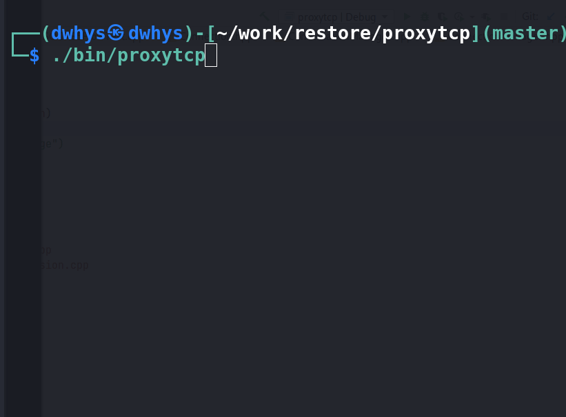

# ProxyTCP
Proxy that allows to visit some HTTPS websites.
Proxy uses 1080 m_port by default
## Build

Build project using commands below:

`sudo cmake -DCMAKE_BUILD_TYPE=Debug .`

`sudo cmake --build .`

## Run

Move to the `bin` folder and run `proxytcp` :

`cd bin/`

`sudo ./proxytcp --mode capture --output ./meme.pcap --port 1080` - for capturing
`sudo ./proxytcp --mode default --port 1080`  - for default execution

Then run browser with appropriate flags or edit its configuratin in settings.

__Chromium__

via terminal: `chromium --proxy-server="socks5://127.0.0.1:1080"  `

__Firefox__

via UI: `Settings->Preferences->Network Settings->Manual proxy configuration-> In Socks host: 127.0.0.1 / Port: 1080`

# Components
[Here](Components.md) you can find components description.

